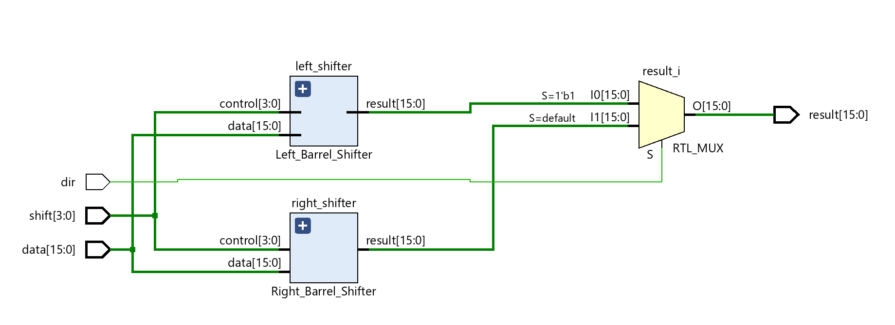
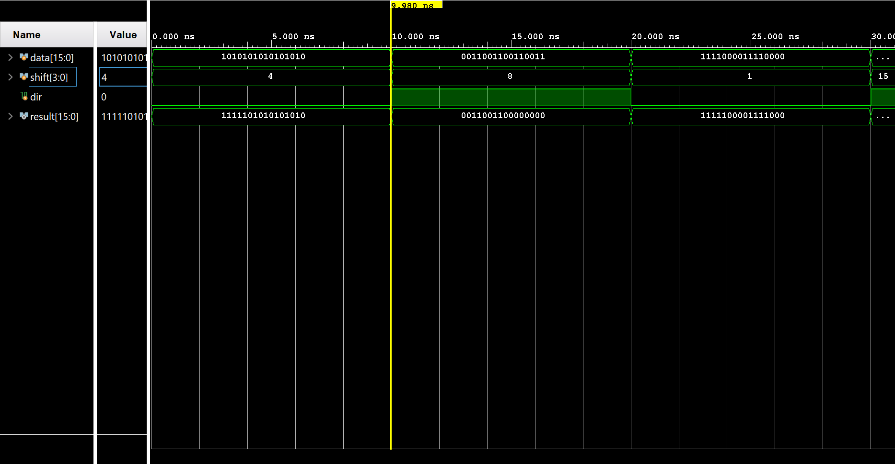

# Barrel Shifter

This project implements a **16-bit barrel shifter** using a multiplexer-based structural design. It performs left or right shifts based on a control signal, while preserving the sign bit.

---

## Schematic

---

## Description

- **Input**:  
  - `A` (16-bit input data)  
  - `shift_sel` (4-bit control input to select shift amount, from 2⁰ to 2¹⁵)  
  - `dir` (1-bit control: 0 for right shift, 1 for left shift)

- **Output**:  
  - `Y` (16-bit shifted result)

---

## Functionality

- When `dir = 0`, performs a **logical right shift**.
- When `dir = 1`, performs a **logical left shift**.
- The design supports **any shift amount** from 0 to 15.
- The **sign bit (MSB)** of the original input is preserved to support signed data.

---

## Design Details

- Implemented using **structural Verilog**, without behavioral constructs.
- Multiple levels of 2:1 multiplexers are cascaded to achieve shift-by-n functionality.
- No `always` blocks or arithmetic operators are used.

---

## Output Verification

- Simulated using **Vivado**.
- Shifted outputs verified against expected binary values for both left and right shift operations.
- The MSB remains unchanged after the shift, preserving the sign.

---

## Output Waveform

---

## Notes

- The design ensures clean and hardware-efficient shifting.
- Future extensions could support rotation modes.
